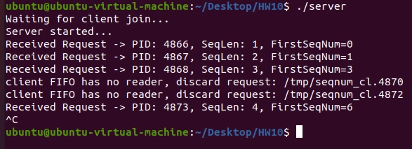
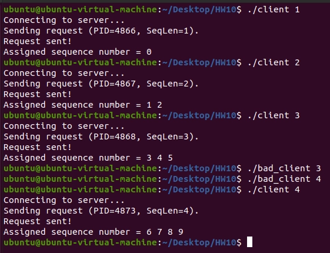
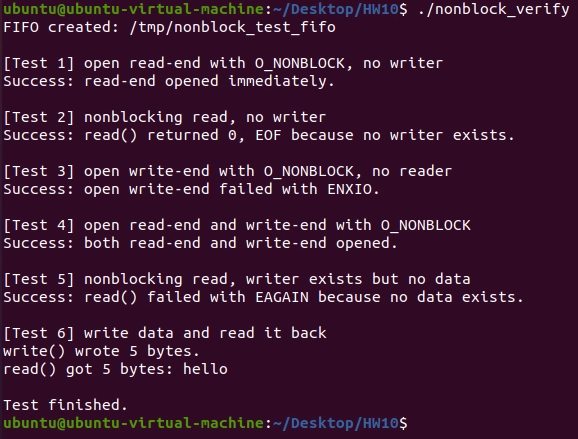
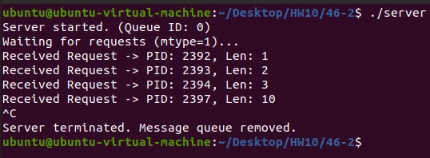
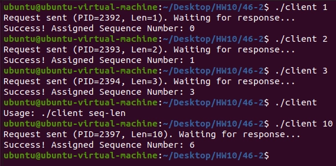

# Homework 10

**B113040045 許育菖**

## 44-6

### Problem Definition

一般使用FIFO在process之間溝通時，若client故意在沒有開啟FIFO的情況下發送request給server，會導致server一直嘗試回傳responce，發生Denial-of-Service (DoS)，使其他client的request被無限期延遲。

我們需要想個方法來避免當惡意的client發送request時，server不會進入busy-waiting的狀態。

### Objectives and Solutions

主要在server端進行偵測。

我們使用`O_NONBLOCK`來開啟寫入client的FIFO，當client沒有開啟FIFO的寫入端時，server會自動忽略這個request，以此避免發生Denial-of-Service的情況。

### Execution Result

server ↑

client ↑

### Testing Steps

1. 開啟兩個terminal，一個做為server，另一個做為client
2. 在server端輸入`./server` 啟動server
3. 在client端輸入`./client <number>`或`./bad_client <number>`，前者是正常的client，後者是惡意client，會被server忽略掉。

---

## 44-7

### Problem Definition

撰寫程式來驗證 FIFO 上的non-blocking open和non-blocking I/O 操作。

### Objectives and Solutions

首先建立一個 FIFO，接著依序測試以下情況：

1. 讀取端以 `O_NONBLOCK` 開啟
    - 在沒有 writer 的情況下可立即成功開啟
2. non-blocking `read()`
    - 當沒有 writer 時，`read()` 回傳 `EOF`
    - 當 writer 存在但尚未寫入資料時，`read()` 回傳 `EAGAIN`
3. 寫入端以 `O_NONBLOCK` 開啟
    - 在沒有 reader 的情況下，`open()` 失敗並回傳 `ENXIO`
4. 正常雙端通訊
    - 當 reader 與 writer 同時存在時，可成功進行資料傳輸與接收

### Execution Result

### Testing Steps

1. 打開terminal
2. 輸入`./nonblock_verify`

---

## 46-2

### Problem Definition

Recode the sequence-number client-server application of *Section 44.8* to use **System V message queues**. 

Use a **single message queue** to transmit messages from both **client to server** and **server to client**. 

Employ the conventions for message types described in *Section 46.8*.

### Objectives and Solutions

System V message queue屬於IPC中**message passing**的一種。

主要使用以下幾個函式來達到process間通訊的目的：

1. `int msgget(key_t key, int msgflg);`
    
    建立或取得 message queue
    
2. `int msgsnd(int msqid, const void *msgp, size_t msgsz, int msgflg);`
    
    發送 message
    
3. `ssize_t msgrcv(int msqid, void *msgp, size_t msgsz, long msgtyp, int msgflg);`
    
    接收 message
    
4. `int msgctl(int msqid, int op, struct msqid_ds *buf);`
    
    刪除message
    

### Execution Result

server ↑

client ↑

### Testing Steps

1. 開啟兩個terminal，一個做為server，另一個做為client
2. 在server端輸入`./server` 啟動server
3. 在client端輸入`./client <number>`
