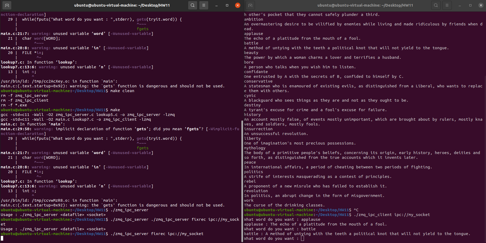
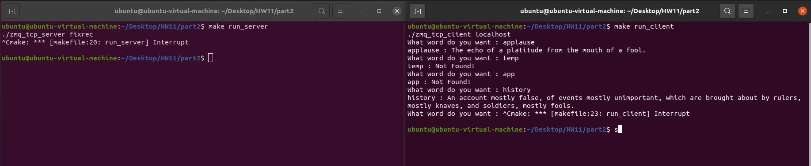
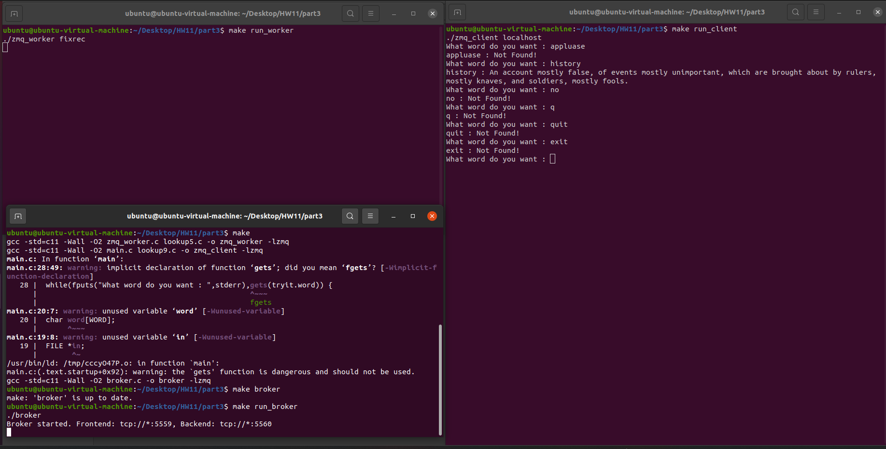

# Homework 11

**B113040045 許育菖**

## **Part1**

### **Problem Definition**

Set up a client and server while talk over ZeroMQ IPC REQ/REP sockets. The server performs the dictionary look up.

1. Edit the `lookup7.c` file to communicate with a server by using ZeroMQ IPC REQ sockets.
2. Edit `zmq_ipc_server.c` to listen on a ZeroMQ IPC REP socket for any number of IPC clients and reply down the same socket.

### **Objectives and Solutions**

本題主要運用 ZeroMQ 的 REQ/REP 模型來實作跨行程通訊（IPC），完成一個可供多個 Client 查詢單字的字典伺服器。

1. **Client 端 (`lookup7.c`)**：
    - 建立 `ZMQ_REQ` socket。
    - 透過指定的資源路徑（例如 `ipc://my_socket`）與 Server 建立連線 (`zmq_connect`)。
    - 傳送想查詢的單字，並等待接收 Server 回傳的解釋結果。
2. **Server 端 (`zmq_ipc_server.c` 與 `lookup5.c`)**：
    - 建立 `ZMQ_REP` socket 並綁定 (`zmq_bind`) 至指定的 IPC 端點。
    - 使用無限迴圈持續等待接收 Client 的查詢請求 (`zmq_recv`)。
    - 為了能快速搜尋 `fixrec` 字典檔，底層使用 `open` 開啟檔案，並利用 `mmap` 將檔案映射至記憶體，最後配合 `bsearch` (二元搜尋法) 來達成高效率的固定長度資料搜尋 (`lookup5.c`)。
    - 搜尋完畢後，將找到的解釋回傳給 Client；若找不到單字，則回傳 `XXXX` 代表 NOTFOUND。

### **Execution Result**

左server、右: client

### **Testing Steps**

1. 打開兩個 terminal，一個作為 Server，另一個作為 Client。
2. 在 terminal 中輸入 `make` 編譯程式。輸入 `strings fixrec` 來查看整個字典檔。
3. 在第一個 terminal 中輸入 `./zmq_ipc_server fixrec ipc://my_socket` 啟動 Server。
4. 在第二個 terminal 中輸入 `./zmq_ipc_client ipc://my_socket` 啟動 Client。
5. 在 Client 端會出現 `What word do you want :` 的提示，請輸入想查詢的單字，即可觀察系統的回傳結果。

---

## **Part2**

### **Problem Definition**

Set up a client and server while talk over ZeroMQ TCP REQ/REP sockets. The server performs the dictionary look up.

1. Edit the `lookup8.c` file to communicate with a server by using ZeroMQ TCP REQ sockets.
2. Edit `zmq_tcp_server.c` to listen on a ZeroMQ TCP REP socket for any number of internet clients and reply down the same socket.
3. After the files have been edited, type make, or make zmq_tcp_server and zmq_tcp_client.
4. When you get the prompt, run the zmq_tcp_server and zmq_tcp_client.

### **Objectives and Solutions**

本題主要運用 ZeroMQ 的 TCP REQ/REP 模型來實作跨網路通訊，完成一個可供多個 Client 透過網路（TCP）查詢單字的字典伺服器。

1. **Client 端 (`lookup8.c`)**：
    - 建立 `ZMQ_REQ` socket。
    - 透過傳入的資源路徑（例如 `localhost`）與預設的 PORT（`5678`），利用 `snprintf` 組合出 TCP 網路端點（例如 `tcp://localhost:5678`），並與 Server 建立連線 (`zmq_connect`)。
    - 傳送想查詢的單字，並透過 `zmq_recv` 等待接收 Server 回傳的解釋結果。
2. **Server 端 (`zmq_tcp_server.c` 與 `lookup5.c`)**：
    - 建立 `ZMQ_REP` socket 並綁定 (`zmq_bind`) 至 `tcp://*:5678`，使其能夠接聽來自各個 IP 來源的 TCP 網路連線請求。
    - 使用無限迴圈持續等待接收 Client 的查詢請求 (`zmq_recv`)。
    - 收到請求後，會呼叫底層的 `lookup5.c`，以 `mmap` 將本地字典檔映射至記憶體，並使用二元搜尋法 (`bsearch`) 進行高效率查詢。
    - 搜尋完畢後，將找到的解釋回傳給 Client；若找不到單字，則將字串設為 `XXXX` 回傳，代表 NOTFOUND。

### **Execution Result**

左server、右: client

### **Testing Steps**

1. 打開兩個 terminal，一個作為 Server，另一個作為 Client。
2. 在 terminal 中輸入 `make` 編譯程式。
3. 在第一個 terminal 中輸入 `make run_server`啟動 Server。
4. 在第二個 terminal 中輸入 `make run_client`啟動 Client。
5. 在 Client 端會出現 ”**What word do you want : ”**的提示，請輸入想查詢的單字，即可觀察系統的回傳結果。

---

## **Part3**

### **Problem Definition**

Set up a client, a broker, and a worker while talk over ZeroMQ ROUTER/DEALER broker sockets. The workers perform the dictionary lookup.

1. Edit the `lookup9.c` file to communicate with the broker by using ZeroMQ REQ sockets.
2. Edit `zmq_worker.c` to connect to the backend DEALER socket, perform dictionary lookup, and send replies back through the broker.
3. After the files have been edited, type make, or make broker, zmq_worker, and zmq_client.
4. When you get the prompt, run the broker, zmq_worker, and zmq_client.

### **Objectives and Solutions**

本題主要運用 ZeroMQ 的 ROUTER/DEALER 代理模式（Broker Pattern），建立一個更具擴充性的 Client-Broker-Worker 架構。透過 Broker 中介層，Client 不需直接知道 Worker 的位置，而 Worker 也可以隨時水平擴充來提升整體系統的查詢效能。

1. **Broker 端 (`broker.c`)**：
    - 作為 Client 與 Worker 之間的中介層。
    - 建立 `ZMQ_ROUTER` socket 作為前端（Frontend），並綁定至 `tcp://*:5559` 接聽來自 Client 的連線請求。
    - 建立 `ZMQ_DEALER` socket 作為後端（Backend），並綁定至 `tcp://*:5560` 提供 Worker 連線註冊。
    - 呼叫 `zmq_proxy(frontend, backend, NULL)` 將前後端連接，讓系統自動處理雙向訊息的非同步路由與轉發。
2. **Worker 端 (`zmq_worker.c` 與 `lookup5.c`)**：
    - 建立 `ZMQ_REP` socket，並透過 `zmq_connect` 連線至 Broker 後端（`tcp://localhost:5560`）。
    - 透過無窮迴圈接收 Broker 轉發來的單字查詢請求。
    - 利用 `lookup5.c` 中所實作的高效能方法（將 `fixrec` 檔案以 `mmap` 映射至記憶體，並使用二元搜尋 `bsearch`）進行單字搜尋。
    - 將找到的單字解釋或 `XXXX`（找不到）透過原 socket 回傳給 Broker。
3. **Client 端 (`lookup9.c`)**：
    - 建立 `ZMQ_REQ` socket。
    - 連線至 Broker 前端（`tcp://localhost:5559`）。
    - 發送想查詢的單字並等待 Broker 回傳最終查尋結果。

### **Execution Result**

左上: worker、左下: broker、右: client

### **Testing Steps**

1. 準備三個 Terminal 視窗，分別對應 Broker、Worker 與 Client。
2. 在第一個 Terminal 中輸入 `make broker` 啟動代理中介層。
3. 在第二個 Terminal 中輸入 `make worker` 啟動 Worker 節點並載入字典檔。
4. 在第三個 Terminal 中輸入 `make client` 啟動 Client 端。
5. 在 Client 端會出現 ”**What word do you want :** ”的提示，請輸入想查詢的單字，驗證訊息是否成功透過 Broker 轉發至 Worker 並取回正確的結果。