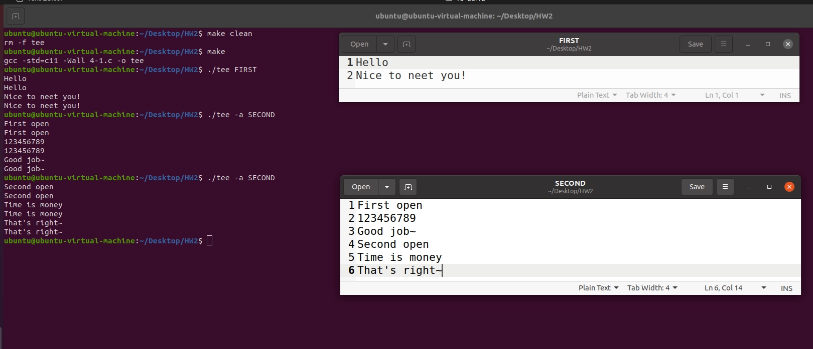
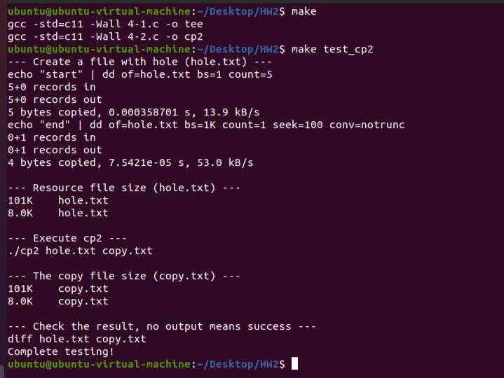

# Homework 2

B113040045 許育菖

## 4-1

### Problem Definition

題目要求製作一個命令 ─ `tee`，主要格式為`tee <filename>`與`tee -a <filename>` 。

- `tee <filename>` ：將standard input的內容分別輸出到standard output和指定檔案中，直到遇到EOF。
    
    若不存在指定檔案，則須先建立一個新的檔案；若存在該檔案，則**清除檔案中的內容，再輸出到該檔案中**。
    
- `tee -a <filename>` ：將standard input的內容分別輸出到standard output和指定檔案中，直到遇到EOF。
    
    若不存在指定檔案，則須先建立一個新的檔案；若存在該檔案，則**直接從檔案結尾接續輸出**。
    

### Objectives and Solutions

兩種格式最大的差別在於如何開檔以及對於option的偵測，程式主要目標為偵測命令格式是否符合，以及透過STDIN_FILENO，將使用者輸入的內容輸出到STDOUT_FILENO以及指定檔案中。

主要結構如下：

1. 命令讀取
2. 以`getopt()`分析option
3. 透過系統全域變數`optind` 檢查命令參數數量  
4. 根據擷取的option選擇開檔模式，此處使用`open()`開檔
5. 使用`read()`讀取STDIN_FILENO中的內容，並將其輸出到STDOUT_FILENO以及檔案中
6. 讀取到EOF時，結束程式

### Execution Result

---

## 4-2

### Problem Definition

題目要求製作一個與`cp` 相似的命令，可以複製檔案，並且當檔案中出現hole (null bytes) 時，也要完整複製hole而不是以space來代替。也就是複製後的檔案在檔案大小與內容排版上要完全相同。主要格式為：`cp <filename for copy> <new filename>`

### Objectives and Solutions

為避免重複命名，在程式中以`cp2` 來作為命令名稱。

此問題最重要的部分在於如果找到data sequence，在此程式中主要採用`lseek(fd, start_position, SEEK_DATA)` 與`lseek(fd, start_position, SEEK_HOLE)` 。前者會將file offset移動到`start_position`後第一個data的位置，並回傳該值；後者則是將file offset移動`start_position`後第一個hole的位置，也同時會會傳該值。將兩值做相減，就可以得到真正需要複製的data sequencet長度。

需要注意的是，使用以上兩個函式都會更改file offset的位置，會進而影響到read()與write()執行的正確性，因此**在確定完data sequence的起始位置與終止位置後，需要將file offset重新移動到data sequence的起始位置上**。

主要結構如下：

1. 命令讀取
2. command line 參數數量檢查，option 檢查
3. 開啟檔案，第一個檔案讀取，第二個檔案寫入
4. 找到檔案結尾 offset，並 reset file offset 到檔案起始位置
5. 透過`SEEK_DATA`找到 data 起始位置，透過`SEEK_HOLE`找到 hole 起始位置，得到 data sequence
6. Reset file offset 到 data 起始位置
7. 使用`read()`和`write()`copy 該 data sequence
8. 重複5~7步驟，直到`lseek(fd1, hole, SEEK_DATA)` 回傳`-1`且`errno == ENXIO`
9. 以`ftruncate(fd2, end)` 處理檔案結尾的hole

### Execution Result

---

## Testing Steps

### [4-1]

1.  Input data directly

 This will create or coverage a file named "FIRST"

`./tee FIRST`

`...input any text you want here, type "EOF" to end program...`

Check the data is output to "FIRST" correctly or not

2. Input data by option `-a`

 If you didn't create a file named "SECOND" before, this will create a new file named "SECOND"

`./tee -a SECOND`

`...input any text you want here, type "EOF" to end program...`

 Check the data is output to "SECOND" correctly or not

3. Input data to "SECOND" again,

 Since we have create a file called SECOND above, this command will open "SECOND", and keep ouput text to the end of "SECOND"

`./tee -a SECOND`

`...input any text you want here, type "EOF" to end program...`

Check the data is continue output to the end of "SECOND" correctly or not

### [4-2]

( The below commands had been write in makefile, just type "`make test_cp2`", and you can see the result )

-

Use command "dd" to create a file with hole.

This file has string "start" in head of file and "end" in end of file.

`echo "start" | dd of=hole.txt bs=1 count=5`

`echo "end" | dd of=hole.txt bs=1K count=1 seek=100 conv=notrunc`

-

Show the size of *hole.txt*

`du -h hole.txt --apparent-size	# Logical size`

`du -h hole.txt	# Actual physical size`

-

Copy the data in *hole.txt* to *copy.txt*, the size of *hole.txt* and *copy.txt* should be the same!

`./cp2 hole.txt copy.txt`

-

Show the size of *copy.txt*

`du -h copy.txt --apparent-size`

`du -h copy.txt`

-

Show the difference between *hole.txt* and *copy.txt*, if there is nothing, that means the program is correct

`diff hole.txt copy.txt`
