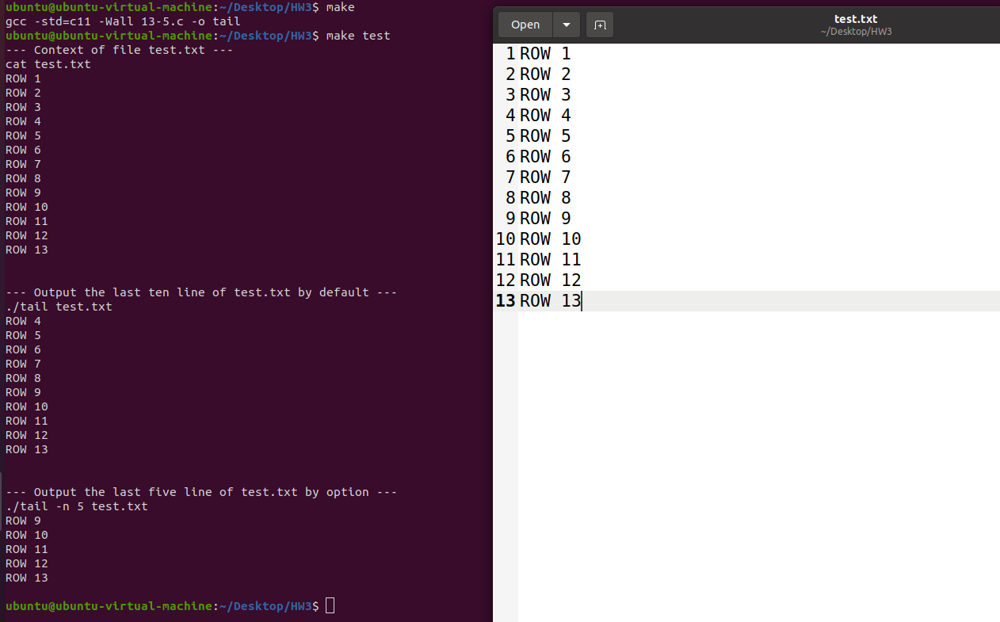

# Homework 3

B113040045 許育菖

## 13-5

### Problem Definition

自製`tail`指令，輸出特定檔案的倒數n行到terminal上，基本格視為：`tail <filename>` ；可使用option來指定要輸出的行數`tail -n <number> <filename>`。

除了上述要求，還要盡可能透過本章節所介紹的buffering細節來提升程式執行效能。

---

### Objectives and Solutions

**初步想法**：從頭開始使用`read()`讀取檔案，記錄整個檔案中出現的`\n`數量，就可知道要在第幾個`\n`後才把檔案內容輸出到terminal中。

**缺點**：對於大檔案效率極差！

**實做方法**：首先，對於 Linux 系統而言，4096 byte 是讀取時最有效率的 buffer 大小。因此採用 4096 作為`read()`的 buffer array 的 size。

再來，使用`lseek()`將`fd`移到檔案結尾，透過從後往前讀取，每次讀取一個 block，並計算出現的`\n`數量，直到達到要求數量，再從該位置開始將檔案內容輸出到 terminal 中。

需要注意的是，Linux 的許多檔案結尾會有一個 `\n` *( 正常應該是EOF )*，因此需要檢查最後一個字元是不是換行，如果是的話要將其忽略掉。

---

### Execution Result



自製tail指令執行結果

---

### Testing Steps

1. Open terminal
2. type `make`
3. type `make test`
4. then the result of `./tail test.txt` and `./tail -n 5 test.txt` will show on the terminal

---

### Note

```c
lseek(fd, offset, whence);
```

**whence**

- `SEEK_SET`: 從頭開始算
- `SEEK_CUR`: 從 fd 目前位置開始算
- `SEEK_END`: 從檔案末端後一個位置開始算
- `SEEK_DATA`: 從下一個非空字元開始算
- `SEEK_HOLE`: 從下一個空字元開始算