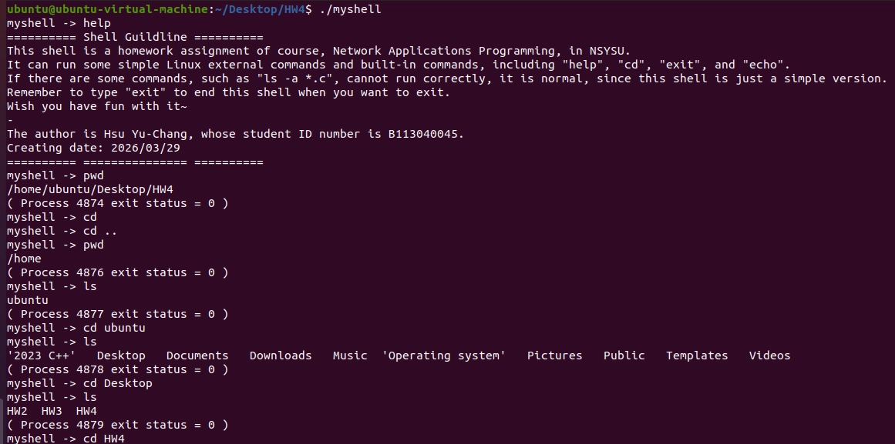
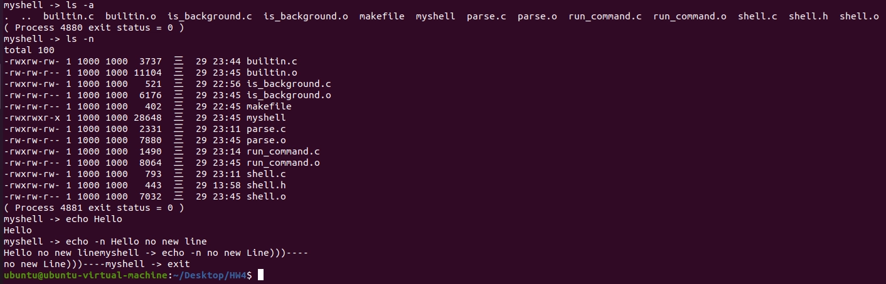
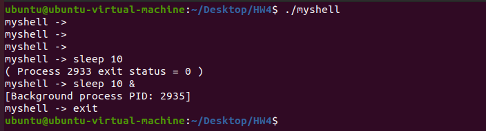

# Homework 4

B113040045 許育菖

### Problem Definition

以課堂中學習到的系統函式完成指定的程式檔案，並以此實現一個簡易的 **Linux shell**。

---

### Objectives and Solutions

依照檔案中的註解指示，一步一步完成 shell。

- **shell.c**

主程式，輸入的指令由此分配給以下不同的程式執行。

- **parse.c**

將 command 用`strtok()`分割成一個一個的字串，這部分要使用`realloc()`來動態分配回傳的command array大小。

- **builtin.c**

建立 build in commands，在此 shell 中，有四條 build in command，分別為`echo`、`cd`、`exit`、`help`。

- **run_command.c**

處理 external commands (e.g. `ls`, `pwd`)，這些 command 都需要在子程序中運行，在此shell中，使用`execvp()`來執行 external commands。

此外，還需要注意指令是不是要求在背景中執行，是的話可以直接回傳，讓使用者可以繼續輸入下一道指令；否則要等待子程序完成，這部分使用`waitpid()`來實現。

- **is_background.c**

檢查 command 的最後一個字串是不是`&`，以判斷這道指令是否需要在背景執行。如果是`&`的話，那就使用`free()`消除最後一個字串(`&`)，並將其改為`NULL`。

---

### Execution Result

“help” command and chage current directory.

Built in command and run a command with option.

Run command in background.

---

### Testing Steps

1. Open terminal
2. type `make` , this will compile and connect all file
3. type `./myshell`
4. then type any command you want in the shell
5. type `exit` to leave the shell