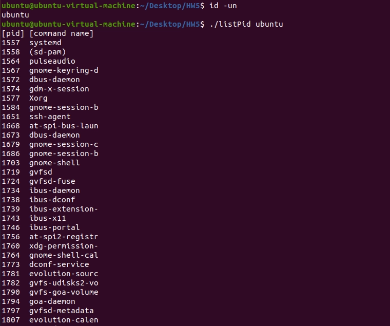
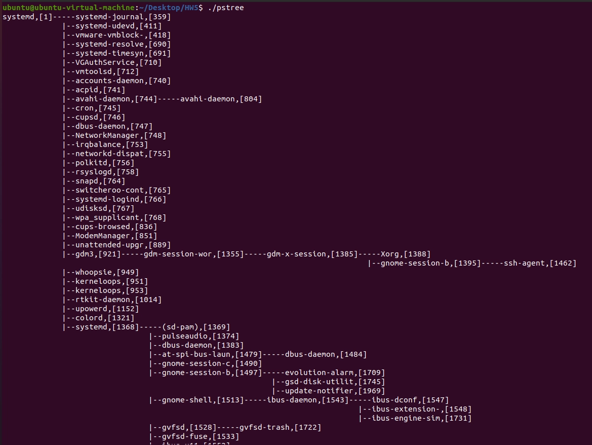
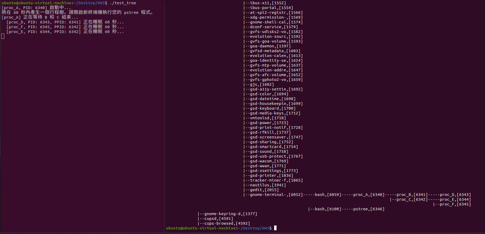
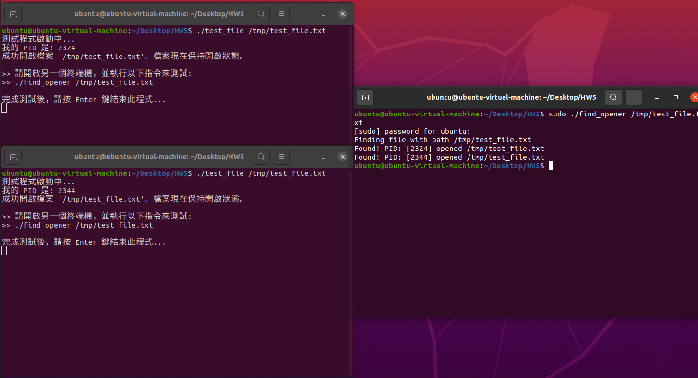

# Homework 5

B113040045 許育菖

## 12-1

### Problem Definition

模擬簡化版的`ps`指令，輸入使用者名稱，列出此使用者正在執行的 process ID 與其對應的 command。

### Objectives and Solutions

**目標**：列出特定使用者正在執行的 process ID 與其對應的 command。

**實做方法**：

1. 讀取命令，並用`opt = getopt(argc, argv, "")` 獲取 option *( 因為此題目無要求 option 功能，因此此處將讀取到的option忽略即可 )*
2. 打開`/proc`資料夾，並使用`userIdFromName()`函式獲取目標使用者的 uid
3. 使用`readdir()`讀取`/proc`下所有的 entry，以`strtol()`判斷讀取的 entry 名稱是否全為數字，是的話即為 pid ！
    
    接著進入`/proc/<pid>`並打開其中的 status 檔案，讀取其中的 command name 以及 uid。
    
    之後檢查該 uid 是否為目標使用者名稱的 uid，是的話將 pid 以及 command name 輸出。
    

### Execution Result

listPid執行結果 (未顯示完全)

### Testing Steps

1. 打開檔案所在terminal
2. 輸入`id -un`以獲取當前使用者名稱
3. 輸入`make` 以makefile進行編譯
4. 根據剛剛獲取的 user name，輸入`./listPid <username>`以及`./listPid root`
5. 查看輸出結果

---

## 12-2

### Problem Definition

建立簡易版的`pstree`指令，先遍歷`/src`中的所有 pid entry，按照其 ppid (parent process ID) 建立一個 process tree，並以類似`pstree`的風格印出。

### Objectives and Solutions

**目標**：印出類似`pstree`風格的 process tree

**實做方法**：

1. 讀取命令
2. 遍歷`/src`，為每個 pid entry 建立 process node。並將所有 node 以 list 進行儲存。
3. 遍歷 list，依照每個 node 的 ppid，再去遍歷一次 list 找到擁有該 ID 的 node，這個 node 即為一開始 node 的 parent node。以此找到所有 node 之間的關係，建立整個 process tree。
4. 從 root 開始，以 **DFS** 的方式遍歷整個 tree，並用以程式中的變數`level`來控制輸出格式，最終可印出 process tree。

### Execution Result

### Testing steps

1. 打開兩個 terminal
2. 其中一個輸入`./test_tree`
3. 另外一個輸入`./pstree` (自製pstree)
4. 檢查印出的 test tree 是否正確

---

## 12-3

### Problem Definition

寫一個指令，可以列出所有開啟了特定檔案路徑名的程式。格式為`./find_opener <file path>` 

### Objectives and Solutions

**目標**：列出所有開啟了特定檔案路徑名的程式。

**實做方法**：

1. 讀取命令，並確保輸入的路徑為**絕對路徑**
2. 遍歷`/src`，找到 pid entry
3. 遍歷`/proc/<PID>/fd`中的所有 link，使用`readlink()`讀取 link 指向的路徑，match 的話就印出開啟該檔案的 pid。可能有多個 pid 開啟同一個檔案。

### Execution Result

左：test file、    右：find_opener，成功找到兩個程序開啟目標檔案

### Testing steps

1. 打開兩個terminal
2. 其中一個輸入`./test_file /tmp/test_file.txt`
3. 另外一個輸入`sudo ./find_opener /tmp/test_file.txt` 
4. 檢查印出的內容是否正確
