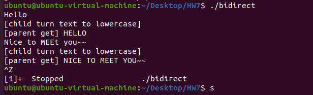
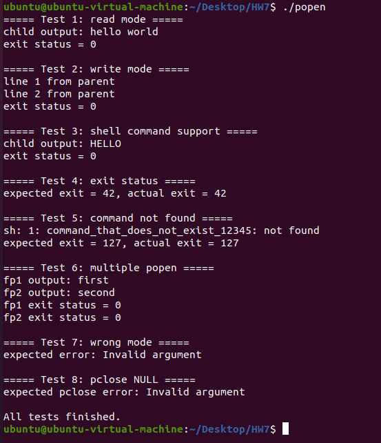

# Homework 7

B113040045 許育菖

---

## 44-1

### Problem Definition

使用兩個 pipe 實現 parent process 與 child process 之間的雙向溝通。

parent process 從標準輸入讀取一段文字，透過 pipe 傳給 child process，child 將文字轉換為大寫後，再透過另一條 pipe 傳回給 parent，最後 parent 將結果輸出到標準輸出。

---

### Objectives and Solutions

**目標**：建立一個雙向通訊機制，使 parent 與 child 可以來回傳遞資料。

**實做方法**：

1. 建立兩個 pipe：
    - pipe1：parent → child
    - pipe2：child → parent
2. 使用 `fork()` 建立 child process
3. 在 parent process 中：
    - 關閉不需要的 pipe 端（pipe1 讀端、pipe2 寫端）
    - 進入迴圈：
        1. 從 `stdin` 讀取一行文字
        2. 將文字寫入 pipe1（傳給 child）
        3. 從 pipe2 讀取 child 回傳的資料
        4. 將結果輸出到 `stdout`
4. 在 child process 中：
    - 關閉不需要的 pipe 端（pipe1 寫端、pipe2 讀端）
    - 持續從 pipe1 讀取資料
    - 將字串轉換為大寫（例如使用 `toupper()`）
    - 將結果寫入 pipe2 回傳給 parent

---

### Execution Result

---

### Testing Steps

1. 開啟 terminal
2. 輸入 `make` 進行編譯
3. 執行 `./bidirect`
4. 在 terminal 中輸入字串
5. 檢查輸出是否轉為大寫

---

## 44-2

### Problem Definition

實作 `popen()` 與 `pclose()` 函式，使 parent process 可以透過 `FILE *` 與 child process 執行的 shell command 進行單向溝通，並支援多個 `popen()` 同時存在的情況。

---

### Objectives and Solutions

**目標**：模擬標準函式 `popen()` / `pclose()` 的行為，並正確管理多個 child process。

**實做方法**：

首先使用一個陣列來儲存fd → pid的對應關係。

1. 在 `popen()` 中：
    - 使用 `pipe()` 建立 pipe
    - 使用 `fork()` 建立 child process
    - 根據 mode 決定資料方向：
        - `"r"`：parent 讀取 child 的輸出（child 的 `stdout` 接到 pipe）
        - `"w"`：parent 寫入 child 的輸入（child 的 `stdin` 接到 pipe）
    - 使用 `dup2()` 進行 file descriptor 重導向
    - 關閉不需要的 pipe descriptors
    - 在 child process 中關閉所有先前 `popen()` 建立的 descriptors（符合 SUSv3 規範）
    - 使用 `execl("/bin/sh", "sh", "-c", command, NULL)` 執行指令
    - 在 parent 中使用 `fdopen()` 將 descriptor 轉為 `FILE *`
2. 在 `pclose()` 中：
    - 使用 `fileno()` 取得對應的 descriptor
    - 查表取得 child PID
    - 呼叫 `fclose()` 關閉 stream
    - 使用 `waitpid()` 等待指定 child 結束
    - 回傳 child 的結束狀態
3. 最後在主函式中進行測試

---

### Execution Result

---

### Testing Steps

1. 開啟 terminal
2. 輸入 `make` 編譯程式
3. 執行程式 `./popen`