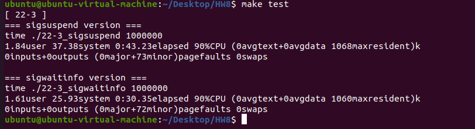
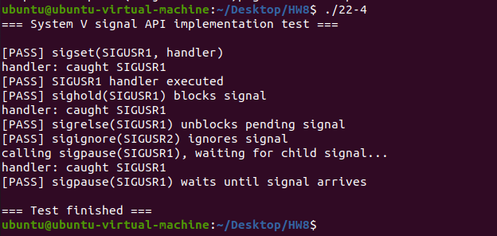

# Homework 8

**B113040045 許育菖**

## 22-3

### Problem Definition

根據課本說明，使用 `sigsuspend()` 搭配 signal handler 與使用 `sigwaitinfo()` 接收 signal 的效率不同。實作兩個版本的程式，讓 parent 與 child process 互相交換 signal 一百萬次，並比較兩種方法的執行時間差異。

---

### Objectives and Solutions

比較 `sigsuspend()` 與 `sigwaitinfo()` 在 signal 傳遞上的效能差異。

---

**實做方法**：

#### (1) `sigsuspend()` 版本

1. 使用 `sigaction()` 設定 `SIGUSR1` 的 handler，當 signal 到達時設定 flag。
2. 使用 `sigprocmask()` 將 `SIGUSR1` block。
3. 建立 child process。
4. parent 與 child 透過以下流程進行 signal 交換：
    - parent 使用 `kill()` 傳送 `SIGUSR1`
    - child 使用 `sigsuspend()` 等待 signal
    - handler 設定 flag，離開 `sigsuspend()`
    - child 回傳 signal 給 parent
5. 重複上述流程指定次數。

**特點：**

- signal handler
- global flag
- `sigsuspend()` 等待

---

#### (2) `sigwaitinfo()` 版本

1. 使用 `sigprocmask()` 將 `SIGUSR1` block（必要條件）。
2. 建立 child process。
3. parent 與 child 使用`sigwaitinfo()`來同步接收 signal。
4. parent 與 child 互相使用 `kill()` 傳送 signal。
5. 重複指定次數。

**特點：**

- 不需要 handler
- 不需要 flag
- signal 直接由 `sigwaitinfo()` 接收

---

#### 差異分析

| 方法 | 特點 |
| --- | --- |
| sigsuspend | 需要 handler + flag，流程較複雜 |
| sigwaitinfo | 同步等待，流程較簡單 |

理論上 `sigwaitinfo()` 應較快，因為避免呼叫 handler 與 context switch

---

### Execution Result



---

### Testing Steps

1. 打開 terminal
2. 輸入 `make` 進行編譯
3. 輸入 `make quick` 測試小規模執行（如 10000 次）
4. 輸入 `make test` 測試 1000000 次 signal 傳遞
5. 比較兩個版本的 `real` 執行時間

---

## 22-4

### Problem Definition

使用 POSIX signal API（如 `sigaction()`、`sigprocmask()`、`sigsuspend()`）實作 System V 提供的五個 signal 函式：

```
sigset()
sighold()
sigrelse()
sigignore()
sigpause()
```

---

### Objectives and Solutions

理解舊式 System V signal API 的行為，並使用現代 POSIX API 進行模擬實作。

---

#### 實做方法

#### `sigset()`

功能：設定 signal handler 或 block signal

實作方式：

1. 使用 `sigaction()` 設定 handler
2. 使用 `sigprocmask()` 控制 block/unblock
3. 若 handler 為 `SIG_HOLD`：
    - 使用 `SIG_BLOCK`
4. 否則：
    - 設定 handler
    - 並解除 block
5. 回傳舊的 handler 或 block 狀態

---

#### `sighold()`

功能：block 某個 signal

實作：`sigprocmask(SIG_BLOCK, ...)`

---

#### `sigrelse()`

功能：解除 block

實作：`sigprocmask(SIG_UNBLOCK, ...)`

---

#### `sigignore()`

功能：忽略 signal

實作：`sigaction(sig,SIG_IGN)`

---

#### `sigpause()`

功能：暫時解除 block 並等待 signal

實作：

1. 取得目前 mask
2. 移除指定 signal
3. 呼叫 `sigsuspend()`

此為 atomic operation，可避免 race condition

---

### 設計重點

- 使用 `sigaction()` 取代舊 `signal()`
- 使用 `sigprocmask()` 控制 signal mask
- 使用 `sigsuspend()` 避免 race condition
- 正確回傳舊狀態以符合 System V 行為

---

### Execution Result



---

### Testing Steps

1. 打開 terminal
2. 輸入 `make` 編譯程式
3. 執行測試程式（內建於 main）
4. 觀察輸出結果：
    - handler 是否正確觸發
    - block/unblock 是否正常
    - ignore 是否生效
    - sigpause 是否能正確等待 signal
5. 確認所有測試結果為 PASS