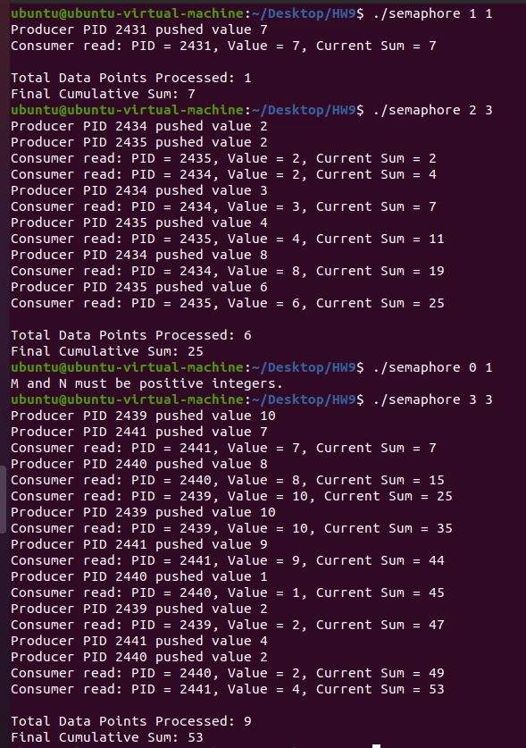

# Homework 9

**B113040045 許育菖**

### Problem Definition

使用semaphore來建立一個M-Producer, 1-Consumer system。Producer負責產生數字，並將數字丟進shared memory (stack) 中，而Consumer負責將shared memory中的數字加總起來，並最後將結果輸出。

---

### Objectives and Solutions

**目標**：

將shared memory中的數字加總並輸出。

**實做方法**：

定義兩個semaphore，`SEM_MUTEX`以及`SEM_FULL` ，其中`SEM_MUTEX`作為存取shared memory的lock；而`SEM_FULL`則是記錄當前stack中有多少資料。

先撰寫`sem_wait_op()`以及`sem_signal_op()`兩個函式，用於增加或減少semaphore的值。

接著透過上述兩個函式以及`SEM_MUTEX`和`SEM_FULL` 實作stack的操作函式`push()`和`pop()`。

最後透過`fork()`產生一個Consumer與指定數量的Producer，同步執行`push()`或`pop()`，將得到的結果輸出即可。

---

### Execution Result

---

### Testing Steps

1. 打開 terminal
2. 輸入 `make` 進行編譯
3. 輸入 `./semaphore <number> <number>`進行測試